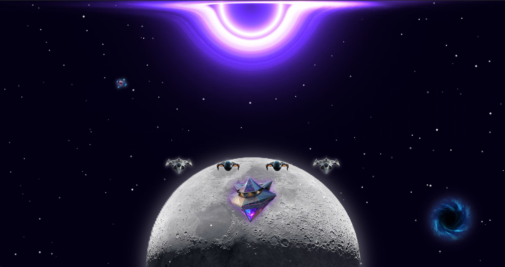
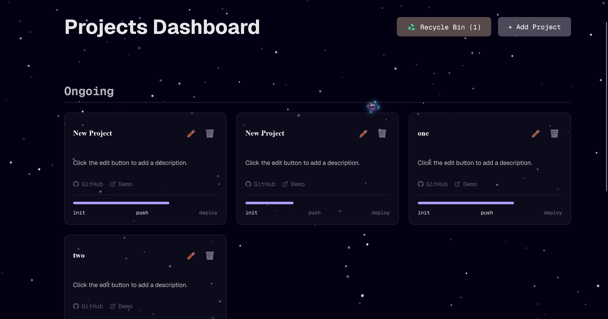

# 🚀 Interactive Space Website

This project is a creative landing page built with Next.js, designed to showcase my profile and projects in an engaging, cosmic environment. Navigate through my digital universe by deploying a fleet of spaceships from the central command station. A portal takes to the `Projects` page showing all my projects status.

---

### 🖼️ Screenshots

| Home Page | Projects Page |
|:---------:|:------------:|
|  |  |


---

## ✨ Core Features

### 🌌 Interactive Hero Page
- A **central space station** that summons animated "spaceship" links (Portfolio, GitHub, Contact, etc.).
- Smooth, sequenced enter/exit animations powered by **Framer Motion**.
- **Multi-layered background**:
  - Interactive starfield generated by **tsparticles** that reacts to mouse movement.
  - Looping background video of a **black hole** at the center.
  - A particle **absorber/destroyer** that slowly consumes stars as time passes.
  - A distant planet surface image for depth.
- **Ambient animation**: A Voyager-style probe continuously traverses the screen via CSS `offset-path`, with a hover tooltip.

### 🛰️ Project Management Dashboard
- **Full CRUD** (Create, Read, Update, Delete) for Projects.
- **Recycle Bin**: soft-delete and restore projects.
- **Project Progress Tracker**: stages such as `init → push → deploy`.
- **Server-side logic** implemented with **Next.js Server Actions**—no traditional API endpoints required.

### 🎨 Styling & Animations
- Scoped CSS using **CSS Modules** and utility-first styles with **Tailwind CSS**.
- Polished micro-interactions and motion choreographed with **Framer Motion** for an immersive feel.

---

## 🛠️ Tech Stack

| Technology | Use Case |
| --- | --- |
| **Next.js (App Router)** | Core application framework |
| **React** | UI layer |
| **TypeScript** | Safer, expressive types |
| **Framer Motion** | UI and transition animations |
| **tsParticles** | Interactive starfield and particle systems |
| **Drizzle ORM** | DB schema & queries (Postgres) |
| **Server Actions** | Server-side mutations without API routes |
| **Tailwind CSS** | Utility-first styling |
| **CSS Modules** | Component-scoped styles |

---

## ⚙️ Getting Started

Follow these instructions to get a local copy up and running.

### Prerequisites

* Node.js (v18.x or later recommended)
* npm, yarn, or pnpm

### Installation & Setup

1.  **Clone the repository:**
    ```bash
    git clone [https://github.com/qtremors/nexus.git](https://github.com/qtremors/nexus.git)
    cd nexus
    ```

2.  **Install dependencies:**
    ```bash
    npm install
    # or
    yarn install
    # or
    pnpm install
    ```

3.  **Place Static Assets:**
    Make sure you have all the necessary static assets (images, videos) in the `/public` directory.

### How to Run

1.  **Run the development server:**
    ```bash
    npm run dev
    # or
    yarn dev
    # or
    pnpm dev
    ```

2.  Open [http://localhost:3000](http://localhost:3000) with your browser to see the result.