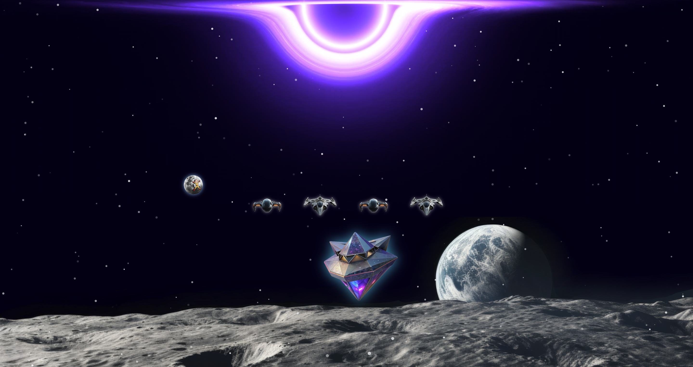

# 🚀 Interactive Space Website

This project is a creative landing page built with Next.js, designed to showcase my profile and projects in an engaging, cosmic environment. Navigate through my digital universe by deploying a fleet of spaceships from the central command station.

---

### 🖼️ Screenshots

| Home Page |
|:---:|
|  |

---

## ✨ Core Features

* **Interactive Navigation**: A central space station that summons animated "spaceship" links (to my Portfolio, GitHub, etc.).
* **Advanced Animations**: Fluid and complex UI animations powered by **Framer Motion**, featuring sequenced enter/exit transitions for a polished user experience.
* **Multi-Layered Background**: A deep and immersive background created with:
    * An interactive starfield generated by **`tsparticles`** that reacts to mouse movement.
    * A looping video of a central black hole.
    * The blackhole eats the stars with the help of **`destroyer`** slowly as time passes.
    * A distant planet's surface.
* **Ambient Animation**: A Voyager space probe continuously traverses the screen using pure CSS `offset-path` animation, with a tooltip visible on hover.
* **Modern Tech Stack**: Built with Next.js, React, and TypeScript for a robust and performant application.
* **Scoped Styling**: Utilizes CSS Modules for clean, component-scoped styling that avoids global namespace conflicts.

---

## 🛠️ Tech Stack

| Technology      | Use Case                                                    |
| --------------- | ----------------------------------------------------------- |
| **Next.js** | The core React framework for building the application.      |
| **React** | The fundamental UI library for creating components.         |
| **Framer Motion**| Powers the complex animations for the spaceships.           |
| **tsParticles** | Generates the interactive, animated starfield background.   |
| **CSS Modules** | Provides locally scoped CSS for component-level styling.    |

---

## ⚙️ Getting Started

Follow these instructions to get a local copy up and running.

### Prerequisites

* Node.js (v18.x or later recommended)
* npm, yarn, or pnpm

### Installation & Setup

1.  **Clone the repository:**
    ```bash
    git clone [https://github.com/qtremors/nexus.git](https://github.com/qtremors/nexus.git)
    cd nexus
    ```

2.  **Install dependencies:**
    ```bash
    npm install
    # or
    yarn install
    # or
    pnpm install
    ```

3.  **Place Static Assets:**
    Make sure you have all the necessary static assets (images, videos) in the `/public` directory.

### How to Run

1.  **Run the development server:**
    ```bash
    npm run dev
    # or
    yarn dev
    # or
    pnpm dev
    ```

2.  Open [http://localhost:3000](http://localhost:3000) with your browser to see the result.